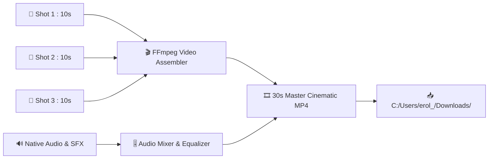

# 🎬 Voyagerroc Media Engine

> Üretilen 3 bağımsız video sahnesini (3 x 10s) sinematik olarak birleştiren (**FFmpeg Concat**), ses miksajını yapan ve render süreçlerini yöneten **Medya İşleme Motoru**.

---

## 🏛️ Montaj & Medya İşleme Hattı

---

## 📂 Dizin Yapısı & Sorumlulukları
- `src/processors/video_processor.py`: FFmpeg ile 3 sahneyi dikişsiz birleştiren montajcı.
- `src/renderers/higgsfield_runner.js`: Higgsfield & Seedance 2.5 için yerel render tetikleyicisi.

---
© 2026 Voyagerroc Automation. All rights reserved.