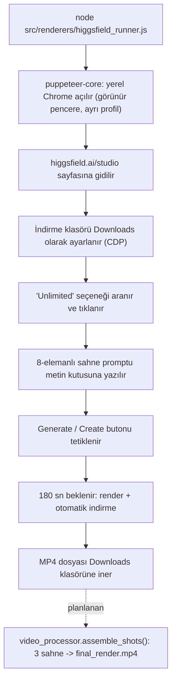

# Voyagerroc Media Engine

Yazılı sahne planlarını (prompt) fiilen **videoya dönüştüren** medya katmanı. Ekosistemdeki rolü: `voyagerroc-agents` ve `content-engine` tarafında hazırlanan 3'lü sahne (3 x 10s) promptlarını alıp Higgsfield Studio üzerinde render işini başlatmak ve çıkan videoyu bilgisayara indirmektir.

Depo iki parçadan oluşur:

- **`src/renderers/higgsfield_runner.js` — çalışır durumda:** `puppeteer-core` ile bilgisayardaki gerçek Chrome'u açar, higgsfield.ai/studio sayfasına gider, "Unlimited" modunu seçmeye çalışır, 8-elemanlı sahne promptunu metin kutusuna yazar, Generate butonunu tetikler ve indirme klasörünü `C:\Users\erol_\Downloads` olarak ayarlar. Prompt şu an dosyanın içinde sabittir (Shot 1 örneği).
- **`src/processors/video_processor.py` — iskelet:** `MediaEngine.assemble_shots()` sınıfı, 3 sahneyi FFmpeg concat ile tek videoda birleştirmek üzere tasarlanmıştır; şimdilik yalnızca hedef dosya yolunu loglayıp döndürür, FFmpeg mantığı henüz yazılmamıştır.

> **Durum:** Prototip. Tarayıcı otomasyonu gerçek ve çalıştırılabilir; video birleştirme (FFmpeg) tarafı iskelet halindedir.

## Render akışı



## Kurulum ve çalıştırma

Gereksinimler: Node.js, `C:\Program Files\Google\Chrome\Application\chrome.exe` yolunda kurulu Chrome ve açılan Chrome profilinde Higgsfield hesabına giriş yapılmış olması.

```bash
npm install                                # puppeteer-core kurulur
node src/renderers/higgsfield_runner.js    # runner'ı başlatır
```

Betik; adım adım Türkçe log basar, Generate'i tetikledikten sonra tarayıcıyı 180 saniye açık tutar ve videonun Downloads klasörüne inmesini bekler.

## Yapılandırma

Her iki bileşen de ortam değişkenleriyle yapılandırılabilir; değişken tanımlı değilse aşağıdaki varsayılanlar kullanılır.

### `src/renderers/higgsfield_runner.js`

| Değişken | Varsayılan | Amaç |
| --- | --- | --- |
| `HF_CHROME_PATH` | `C:\Program Files\Google\Chrome\Application\chrome.exe` | Puppeteer'ın başlatacağı Chrome çalıştırılabilir dosyasının yolu |
| `HF_DOWNLOAD_DIR` | `C:\Users\erol_\Downloads` | Render edilen MP4'ün indirileceği klasör (CDP `Page.setDownloadBehavior` ile ayarlanır) |
| `HF_PROFILE_DIR` | betiğe göre `../../../../.gemini/antigravity-ide/scratch/chrome_session_clean` (depo konumuna bağlı) | Higgsfield oturumunun saklandığı ayrı Chrome kullanıcı profili; klasör yoksa otomatik oluşturulur |

### `src/processors/video_processor.py`

| Değişken | Varsayılan | Amaç |
| --- | --- | --- |
| `MEDIA_ENGINE_OUTPUT_DIR` | `C:/Users/erol_/Downloads` | `MediaEngine.assemble_shots()` çıktısının (`final_render.mp4`) yazılacağı klasör |

## Klasör yapısı

```
media-engine/
├── src/
│   ├── renderers/
│   │   └── higgsfield_runner.js   # Puppeteer tabanlı Higgsfield otomasyonu (çalışır)
│   └── processors/
│       └── video_processor.py     # FFmpeg birleştirme iskeleti (henüz stub)
├── docs/                          # (henüz boş)
├── package.json                   # bağımlılık: puppeteer-core ^22
└── README.md
```

## Ekosistem: Voyagerroc-Automation

Bu depo, Voyagerroc-Automation organizasyonundaki içerik/otomasyon ekosisteminin bir parçasıdır:

| Depo | Rolü |
| --- | --- |
| [automation-os](https://github.com/Voyagerroc-Automation/automation-os) | Orkestrasyon beyni ve API kapısı |
| [content-engine](https://github.com/Voyagerroc-Automation/content-engine) | İçerik / senaryo ve hook üretimi |
| **media-engine** (bu depo) | Video / ses / görsel işleme ve render |
| [voyagerroc-agents](https://github.com/Voyagerroc-Automation/voyagerroc-agents) | Otonom ajanlar (yönetmen katmanı) |
| [automation-dashboard](https://github.com/Voyagerroc-Automation/automation-dashboard) | İzleme ve kontrol paneli |
| [infrastructure](https://github.com/Voyagerroc-Automation/infrastructure) | Docker / Redis / nginx altyapısı |
| [giant-automation-library](https://github.com/Voyagerroc-Automation/giant-automation-library) | n8n iş akışları |
| [youtube-shorts-pipeline](https://github.com/Voyagerroc-Automation/youtube-shorts-pipeline) | Yayınlama (YouTube Shorts) |

---
© 2026 Voyagerroc Automation. All rights reserved.
